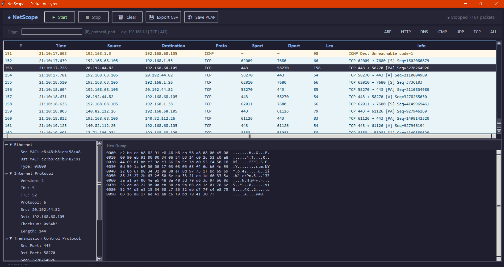

NetScope Packet Analyzer

A Wireshark-inspired packet analyzer with real-time capture, filtering, protocol decoding, and a modern GUI.

---

Preview



(Add your screenshot file named "preview.png" in the repo)

---

Features

- Real-time packet sniffing
- Multi-protocol support (TCP, UDP, ICMP, ARP, DNS, HTTP)
- Filtering by IP, protocol, and port
- Color-coded packet visualization
- Live traffic statistics
- Searchable packet logs
- Export to CSV and PCAP
- Detailed packet breakdown
- Hex dump viewer

---

Tech Stack

- Python
- Tkinter (GUI)
- Scapy

---

Installation

1. Clone the repository
```bash
git clone https://github.com/ishaanatre27/netscope-packet-analyser.git
cd netscope-packet-analyser
